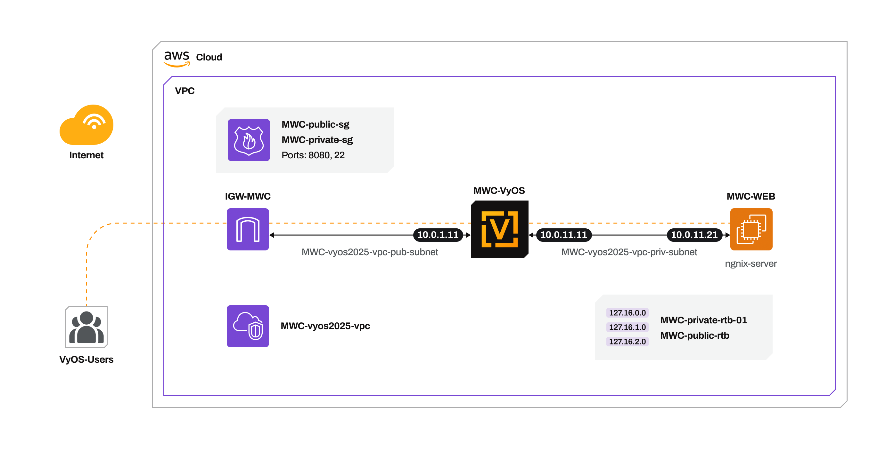

# Mobile World Conference 2025 - VyOS DEMO

# Terraform Module: AWS VPC with VyOS Cloud Gateway  

This Terraform module automates the creation of a **Virtual Private Cloud (VPC)** with networking components, including **public and private subnets, route tables, Internet Gateway (IGW), and Network Security Groups (NSG)**.  

VyOS is used as the **cloud gateway**, handling NAT, port forwarding, and routing traffic to AWS services.  

## Features  

- **VPC Creation** with both public and private subnets  
- **Public and Private Route Tables** for proper traffic segmentation  
- **Internet Gateway (IGW)** for external connectivity  
- **Network Security Groups (NSG)** to enforce security rules  
- **VyOS as the Cloud Gateway** for routing and NAT functionality  
- **Automated Public IP Assignment** for the VyOS instance  

## VyOS Cloud Gateway  

VyOS acts as a central **networking hub** for our AWS resources, enabling:  

- **NAT (Network Address Translation)** to allow private instances to access the internet  
- **Port Forwarding** to route external traffic to internal services  
- **Secure Routing** between AWS resources  

## SSH Access to VyOS  

To connect to the VyOS router, you need to generate an **SSH key pair** (public/private).  

- VyOS can be accessed over the internet via **SSH (port 22)**.  
- The default SSH user is **vyos**.  
- A **public IP address** is dynamically assigned to the VyOS instance.  

## Use Case  

This module enables the deployment of an **Ubuntu-based virtual machine (VM) running a web server**, which is accessible over the internet. **VyOS ensures secure connectivity** to the web server while providing efficient routing and access control.  

### Key Benefits  

- **Cloud Gateway Implementation** for optimized access to AWS resources  
- **Cost and Time Efficiency** with a fully automated deployment  
- **No Manual Intervention Required**, ensuring seamless infrastructure setup  

  

## High level diagram on Azure




### Prerequisites  

## Getting Started

## Requirements

| Name | Version |
|------|---------|
| terraform | >= 1.2.5 |
| hashicorp/aws| ~> 5.0 |

## Providers

| Name | Version |
|------|---------|
| hashicorp/aws| ~> 5.0 |

## Usage

To run this example you need to execute:

```bash
$ terraform init
$ terraform plan
$ terraform apply
```
## Outputs
```bash
$ VyOS_Public_IP_Address = "x.x.x.x"